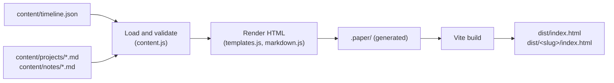

# The timeline

The page at `/`: what it shows, how to change what it says, and how it is generated. For setup and deployment see [development.md](development.md).

## Contents

- [At a glance](#at-a-glance)
- [Add or change an entry](#add-or-change-an-entry)
- [Entry fields](#entry-fields)
- [Write a walkthrough](#write-a-walkthrough)
- [The Markdown it accepts](#the-markdown-it-accepts)
- [Figures](#figures)
- [Notes](#notes)
- [Drafts](#drafts)
- [How a page is generated](#how-a-page-is-generated)
- [Where to change what](#where-to-change-what)
- [Gotchas](#gotchas)

## At a glance

One line of years runs down the middle of the page. **Work** hangs on its left; **projects and learning** hang on its right. Anything that started in the same year sits side by side. A role or a degree is a *main* event: it gets a logo, a larger title, a ring on the line and one line of skills. Everything else is a small dot with a compact title.

Everything on the page comes from files in `content/`. The code in `paper/` reads them, validates them, and writes static HTML during the Vite build. The browser gets finished pages; the page's own script only names the current section in the header and draws figures in as they scroll into view.



## Add or change an entry

Every dated thing is one object in the `entries` array of [`content/timeline.json`](../content/timeline.json). Order in the file does not matter; the page sorts by `start`.

```json
{
  "id": "hisaab-tracker",
  "kind": "project",
  "start": "2026-06",
  "label": "Pet project",
  "title": "Hisaab, a finances tracker",
  "summary": "A local app for two people that replaced a finance spreadsheet.",
  "skills": ["Python", "Streamlit", "pytest"],
  "repo": "https://github.com/rvs-23/hisaab-tracker",
  "draft": true
}
```

Save the file and the dev server reloads the page. A mistake (a missing field, a logo that does not exist) stops the build and lists every problem at once.

The header comes from the `site` object in the same file: `name`, `motto`, `dek` (the line of titles), `intro`, `description` (for search engines) and `links`.

## Entry fields

| Field | Required | What it is |
|---|---|---|
| `id` | yes | Kebab-case, unique. It is the entry's anchor on the page (`/#nebula`). `main`, `timeline`, `colophon` and `note-…` are taken. |
| `kind` | yes | `work`, `study`, `learn` or `project`. `work` goes in the left column; the rest go right. |
| `start` | yes | `YYYY` or `YYYY-MM`. Decides the year row and the order within it. |
| `end` | no | `YYYY`, `YYYY-MM` or `"present"`, not before `start`. Shown as "Oct 2022 → Aug 2025". |
| `label` | yes | The small line above the title: an organisation, or "Pet project". |
| `title` | yes | The entry's name. |
| `summary` | yes | One line. |
| `main` | no | `true` for a role or degree: logo, larger title, ring, skills line. |
| `logo` | no | A file in `content/logos/` (`.svg` or `.png`). Shown on main events. |
| `skills` | no | A list of strings. Shown on main events and on the walkthrough page. |
| `walkthrough` | no | `/<slug>/` for a page in `content/projects/`, or an `https://` article. |
| `repo` | no | An `https://` link, shown as "Code". The title links here when there is no walkthrough. |
| `thumb` | no | A small figure: a file in `content/figures/`, or `{ "type": "pipeline", "steps": [...] }`. |
| `tag` | no | A boxed word before the label, such as `"Explainer"`. |
| `body` | no | Extra Markdown under the summary. Rarely needed. |
| `draft` | no | `true` while the wording is not final. See [Drafts](#drafts). |

## Write a walkthrough

A walkthrough is a page of its own at `/<slug>/`, written in Markdown.

1. Create `content/projects/<slug>.md`:

   ```markdown
   ---
   title: Nebula, a retrieval assistant
   summary: One line, shown under the title and to search engines.
   draft: true
   ---

   ## What it is

   Body text.
   ```

2. Point an entry at it: `"walkthrough": "/<slug>/"`.

The build fails if an entry names a page that does not exist, or a page exists that no entry links to. A slug may not collide with a folder the site already uses (`matrix`, `assets`, `config` and a few others).

## The Markdown it accepts

Standard Markdown with tables and footnotes, plus a small set of extras. Anything outside this list fails the build with the file and line, so a typo cannot ship as broken layout.

| You write | You get |
|---|---|
| `:::margin{label="RAG"}` … `:::` | A note in the margin, with a bold lead-in term |
| `:::note`, `:::tip`, `:::warning` | A ruled callout |
| `:::epigraph` | A large serif quotation |
| `[RAG]{.smallcaps}` | Small capitals |
| `` alone in a paragraph | A numbered figure with the SVG inlined |
| A `mermaid` block with a linear `flowchart` | A pipeline figure in the page's own style |

Not allowed: raw HTML, unknown `:::` blocks, images that are not `figures/*.svg`, images inside a sentence, and links that are not `http(s)`, `mailto:`, `#anchor` or root-relative.

## Figures

Figures are hand-written SVG files in `content/figures/`, inlined into the page so they take the page's ink colour and can animate.

- Use `stroke="currentColor"` and no fills, so the figure follows the page's ink.
- Give a path `class="d"` and `pathLength="1"` to have it draw itself in when it scrolls into view. Readers who ask for reduced motion see it complete.
- `class="soft"` draws a stroke in the hairline grey; `class="fill"` fills a shape with ink.
- Text inside a figure uses `class="fig-label"` (mono) or `class="fig-note"` (serif italic).

An entry's `thumb` shows the same figure small on the timeline.

## Notes

A note is a dated piece of writing in `content/notes/YYYY-MM-DD-<slug>.md`, with `title`, `date` and `summary` in its front matter. It joins the timeline in its year, gets a page at `/<slug>/`, and appears in the RSS feed at `/feed.xml`. Two options:

- `inline: true` keeps a short note on the home page, opened in place, with no page of its own.
- `source: docs/primer/01-….md` borrows the body from another Markdown file in the repo, so a document is written once.

There are no notes yet; the folder is empty.

## Drafts

Mark anything unfinished with `"draft": true` (entries, and `site` for the header) or `draft: true` (walkthroughs and notes).

- By default a draft is published with a dashed "in review" tag beside it.
- With `PAPER_PUBLISH=production`, a draft entry, header or walkthrough fails the build and is named in the error. Draft notes are left out instead.

When all the copy is final, remove every draft flag and set `PAPER_PUBLISH=production`, so nothing unfinished can ship by accident. [development.md](development.md#release-modes) has the full table.

## How a page is generated

[`paper/vite-plugin.js`](../paper/vite-plugin.js) runs these steps at the start of every dev and build run.

1. **Load and validate.** [`content.js`](../paper/content.js) reads `timeline.json` and every Markdown file, checks each field, and collects all errors before throwing.
2. **Render.** [`templates.js`](../paper/templates.js) builds each page as a template string. [`timeview.js`](../paper/timeview.js) groups entries into year rows and columns. [`markdown.js`](../paper/markdown.js) turns Markdown into HTML through unified, remark and rehype; [`figures.js`](../paper/figures.js) draws pipeline figures.
3. **Write.** Pages go to `.paper/` at the repo root (`.paper-dev/` for the dev server, so a build never disturbs a running one). Both are gitignored and wiped on every run, so a deleted page cannot linger. A `404.html` is written alongside.
4. **Bundle.** The pages are registered as Vite HTML entries, so Vite fingerprints the CSS, script and logos. In the bundle step the plugin moves each page from `.paper/` to the site root and writes `feed.xml`, `sitemap.xml` and `robots.txt` (not in preview), `_redirects`, and `config/content/paper.json` (the index the terminal's `about` and `notes` commands read).

In dev, a middleware maps `/` and `/<slug>/` onto the files in `.paper-dev/` and regenerates them when anything in `content/` or `paper/` changes.

## Where to change what

| To change | Edit |
|---|---|
| What an entry says, or the header | `content/timeline.json` |
| A walkthrough's text | `content/projects/<slug>.md` |
| Which kinds go in which column | `COLUMNS` in `paper/timeview.js` |
| The HTML of an event, the header, the footer | `paper/templates.js` |
| Colours, type sizes, the grid | The tokens at the top of `paper/paper.css` |
| The phone layout | The `max-width: 62rem` block in `paper/paper.css` |
| A rule about what content is valid | `paper/content.js`, with a test in `tests/paper.test.js` |

## Gotchas

- **`.paper/` and `.paper-dev/` are generated.** Edit `content/` or `paper/`, never the files in them.
- **The page is three grid columns wide** (date, text, rail). Walkthrough pages use the text column, with margin notes in the rail. The home page spans all three.
- **A bare year sorts as January.** An entry with `"start": "2023"` sits below one with `"start": "2023-03"` in the same year row.
- **Skills only show on main events.** A project's skills appear on its walkthrough page, not on the timeline.
- **Fonts are self-hosted** in `paper/fonts/`. The page makes no third-party requests.
